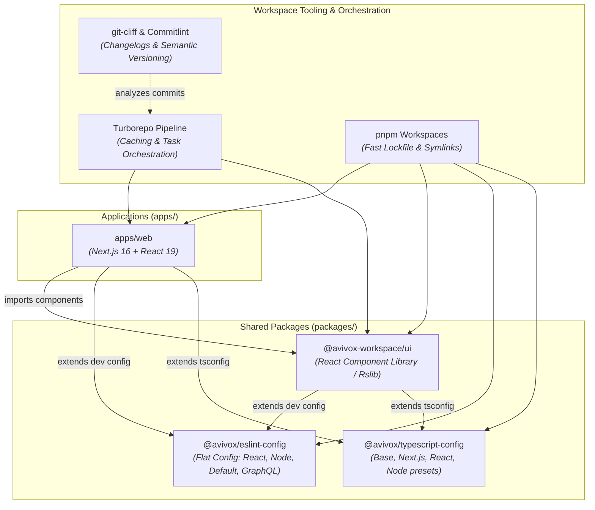

# 🏛️ Monorepo Architecture & Technology Stack Reference

This document provides a comprehensive technical breakdown of the **Avivox Workspace** monorepo architecture, technology stack, package boundary rules, build engines, and dependency graph.

---

## 🛠️ 1. Technology Stack Summary

| Layer / Concern | Technology | Version | Purpose & Configuration |
|---|---|---|---|
| **Monorepo Engine** | [Turborepo](https://turbo.build/repo) | `latest` | Orchestrates parallel task pipelines, caching (`.turbo`), and dependency hashing via [`turbo.json`](../turbo.json). |
| **Package Manager** | [pnpm](https://pnpm.io/) | `10.33.0` | Fast, disk-space efficient workspace dependency management via [`pnpm-workspace.yaml`](../pnpm-workspace.yaml). |
| **Runtime Environment** | Node.js | `>=24.0.0` | Modern JavaScript runtime supporting ESM modules natively. |
| **Frontend Framework** | [Next.js](https://nextjs.org/) | `16.2.3` | App Router-based production web application inside [`apps/web`](../apps/web). |
| **Core UI Library** | [React](https://react.dev/) | `19.2.5` | Modern React with Server Components & Action support. |
| **Styling & Design Tokens** | [Tailwind CSS](https://tailwindcss.com/) | `4.2.4` | PostCSS-driven styling system used across `apps/web` and `packages/ui`. |
| **Icons** | [Lucide React](https://lucide.dev/) | `^1.14.0` | Lightweight, customizable SVG icon set. |
| **Component Build Engine** | [Rslib](https://lib.rsbuild.dev/) | `latest` | High-speed Rust-based library bundler emitting ESM & CJS builds for `packages/ui`. |
| **Language & Typing** | [TypeScript](https://www.typescriptlang.org/) | `6.0.2` | Strict workspace-wide static type checking. |
| **Code Linting** | [ESLint](https://eslint.org/) | `9.39.2` | Flat config architecture implemented in `packages/eslint-config`. |
| **Code Formatting** | [Prettier](https://prettier.io/) | `^3.8.2` | Automated opinionated formatting rules. |
| **Unit & Integration Tests** | [Jest](https://jestjs.io/) + [SWC](https://swc.rs/) | `29.7.0` | Ultra-fast TypeScript test runner powered by `@swc/jest`. |
| **Changelog & Versioning** | [git-cliff](https://git-cliff.org/) | `latest` | Automatic changelog generation & semver detection via [`cliff.toml`](../cliff.toml). |
| **Commit Message Linter** | [commitlint](https://commitlint.js.org/) | `^20.5.0` | Enforces Conventional Commits via [`commitlint.config.js`](../commitlint.config.js). |
| **Cloud Hosting** | [Railway](https://railway.com/) | Cloud | Staging preview environments and production web deployments. |

---

## 📦 2. Workspace Directory Structure

```
avivox-workspace/
├── apps/
│   └── web/                               # Next.js 16 Application
│       ├── src/
│       │   ├── app/                       # App router pages (Home, Architecture, Workflow)
│       │   └── lib/content.ts             # Workspace metadata and link definitions
│       ├── package.json                   # Web dependencies (imports @avivox-workspace/ui)
│       └── next.config.ts                 # Next.js build configuration
├── packages/
│   ├── ui/                                # Shared React 19 UI Component Library
│   │   ├── src/                           # Component primitives (Button, Card, Layout, etc.)
│   │   ├── rslib.config.ts                # Dual ESM/CJS build configuration
│   │   └── package.json                   # Exports: @avivox-workspace/ui
│   ├── eslint-config/                     # Centralized ESLint Flat Configurations
│   │   ├── default.js                     # Base JavaScript / Node configuration
│   │   ├── react.js                       # React / JSX / Hooks rules
│   │   ├── node.js                        # Node.js runtime configuration
│   │   ├── graphql.js                     # GraphQL schema & operation linting
│   │   ├── native.js                      # React Native linting rules
│   │   └── package.json                   # Exports: @avivox/eslint-config
│   └── typescript-config/                 # Centralized TypeScript tsconfig presets
│       ├── tsconfig.base.json             # Workspace base compiler options
│       ├── nextjs.json                    # Next.js App Router tsconfig preset
│       ├── react.json                     # React component library tsconfig preset
│       ├── node.json                      # Node server tsconfig preset
│       ├── native.json                    # React Native compiler preset
│       └── package.json                   # Exports: @avivox/typescript-config
├── docs/                                  # Central Documentation Portal
│   ├── README.md                          # Documentation index
│   ├── ARCHITECTURE.md                    # Architecture & Tech Stack (This File)
│   ├── WORKFLOW-GUIDE.md                  # Developer & QA lifecycle guide
│   ├── COMMIT-GUIDELINES.md               # Conventional commit guidelines
│   ├── BRANCH-PROTECTION.md               # GitHub Rulesets & protection guide
│   ├── CI-CD-PIPELINE.md                  # Workflows & secrets reference
│   ├── PROMPTS-GUIDE.md                   # Copilot prompt library reference
│   └── TEMPLATING-GUIDE.md                # Template initialization & upstream sync guide
├── .github/
│   ├── actions/                           # Local Composite Actions
│   │   ├── setup/action.yaml              # Environment setup, pnpm, Node, & Turbo caching
│   │   └── ci/action.yaml                 # Configurable CI pipeline (lint, type-check, test, build)
│   ├── workflows/                         # GitHub Actions CI/CD Pipeline
│   │   ├── dev.yml                        # Dev branch validation
│   │   ├── create-qa.yml                  # Developer promotion: dev/* -> qa/*
│   │   ├── qa.yml                         # QA branch validation
│   │   ├── create-beta.yml                # QA promotion: qa/* -> main (PR)
│   │   ├── beta.yml                       # Staging deployment & beta package publishing
│   │   ├── beta-cleanup.yml               # Ephemeral staging environment teardown
│   │   ├── prod.yml                       # Production deployment, changelog, releases, npm latest
│   │   └── patch.yml                      # Emergency hotfix deployment direct to production
│   ├── prompts/                           # GitHub Copilot prompt files
│   │   ├── commit-message.prompt.md       # Copilot Conventional Commit prompt (/commit-message)
│   │   ├── sync-docs.prompt.md            # Auto Documentation Sync prompt (/sync-docs)
│   │   ├── template-init.prompt.md        # Template Project Initialization prompt (/template-init)
│   │   └── sync-upstream.prompt.md        # Upstream Template Synchronization prompt (/sync-upstream)
│   └── copilot-instructions.md            # Global GitHub Copilot workspace instructions
├── turbo.json                             # Turborepo task pipeline definitions
├── pnpm-workspace.yaml                    # pnpm workspace configuration
├── cliff.toml                             # git-cliff changelog parsing & semver bump rules
├── commitlint.config.js                   # Strict conventional commit rules & allowed scopes
└── package.json                           # Root monorepo scripts & devDependencies
```

---

## 📐 3. Visual Architecture & Dependency Graph

The diagram below illustrates the strict unidirectional dependency boundary between applications and workspace packages:



---

## 🧱 4. Package Boundaries & Architectural Rules

1. **Isolation of Concerns**:
   - `apps/web` is responsible for presentation, routing, server actions, and layout composition. It **MUST NOT** define private raw UI primitives that could be reused; reusable primitives belong in `packages/ui`.
   - `packages/ui` contains stateless design primitives (Buttons, Cards, Badges, Layout containers, Navbars, Footers) built with Tailwind CSS and bundled via **Rslib**.
   - `packages/eslint-config` maintains shared ESLint 9 Flat Configs (`default.js`, `react.js`, `node.js`, `graphql.js`, `native.js`).
   - `packages/typescript-config` provides centralized compiler presets (`tsconfig.base.json`, `nextjs.json`, `react.json`, `node.json`, `native.json`).

2. **Dual ESM & CJS Output**:
   - `packages/ui` builds dual module formats (`build/*.js` for ESM and `build/*.cjs` for CommonJS) along with strict TypeScript declarations (`build/*.d.ts`) via Rslib.

3. **Task Orchestration with Turborepo**:
   - Tasks (`build`, `dev`, `lint`, `type-check`, `test`) are orchestrated via [`turbo.json`](../turbo.json) with aggressive caching in `.turbo/`.

