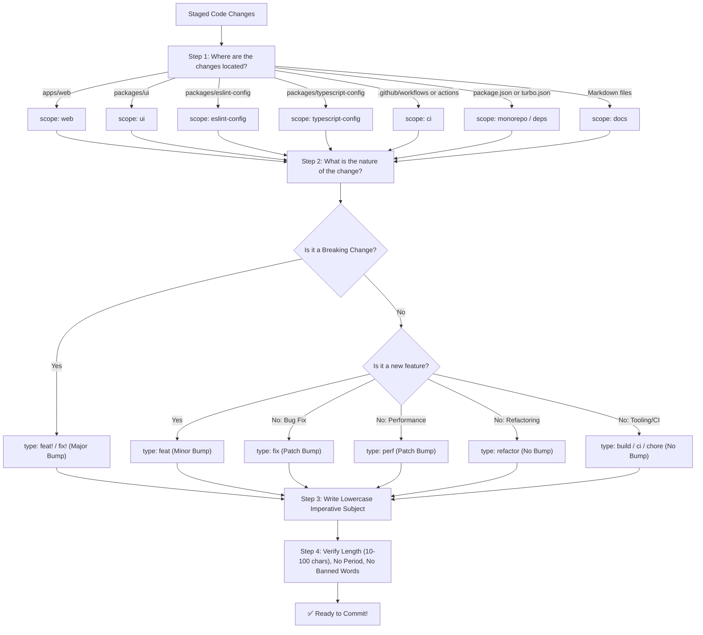

# ✍️ Avivox Workspace — Commit Message Guidelines & AI Generation Guide

Welcome to the official **Commit Message Guidelines** for Avivox Workspace. This document is a comprehensive, beginner-friendly guide for developers, QA engineers, and automated AI agents to write clean, standard, and automated Conventional Commit messages.

---

## 📑 Table of Contents

1. [Why Conventional Commits Matter](#1-why-conventional-commits-matter)
2. [Commit Anatomy & Structure](#2-commit-anatomy--structure)
3. [Allowed Commit Types & SemVer Impact](#3-allowed-commit-types--semver-impact)
4. [Allowed Monorepo Scopes](#4-allowed-monorepo-scopes)
5. [Subject Line Rules & Banned Words](#5-subject-line-rules--banned-words)
6. [Handling Breaking Changes](#6-handling-breaking-changes)
7. [How to Generate Commits with GitHub Copilot](#7-how-to-generate-commits-with-github-copilot)
8. [Visual Decision Tree for Developers](#8-visual-decision-tree-for-developers)
9. [Concrete Examples (Good vs. Bad)](#9-concrete-examples-good-vs-bad)
10. [Local Validation & Troubleshooting](#10-local-validation--troubleshooting)

---

## 1. Why Conventional Commits Matter

In Avivox Workspace, commit messages are not just human notes—they are **machine-readable instructions** that drive our automated release engine:

- **Automated Version Bumping**: `prod.yml` detects your commit types to decide whether to bump patch (`0.1.1`), minor (`0.2.0`), or major (`1.0.0`) versions.
- **Automated Changelogs**: `git-cliff` reads commits to generate clean, categorized `CHANGELOG.md` files for each package.
- **Automated Quality Gate**: `commitlint` runs on every pull request and push to ensure team consistency.

```
Your Commit ──> Commitlint Validation ──> PR Merge ──> git-cliff Changelog ──> Auto SemVer Bump
```

---

## 2. Commit Anatomy & Structure

Every commit message **MUST** strictly follow the Conventional Commits 1.0.0 specification:

```
<type>(<scope>): <subject>

[optional body]

[optional footer(s)]
```

### 📏 Size & Grammar Constraints

| Rule | Requirement | Enforced By |
|---|---|---|
| **Header Max Length** | ≤ 100 characters | `commitlint.config.js` (`header-max-length`) |
| **Body Line Length** | ≤ 120 characters per line | `commitlint.config.js` (`body-max-line-length`) |
| **Footer Line Length** | ≤ 120 characters per line | `commitlint.config.js` (`footer-max-line-length`) |
| **Case** | Lowercase only (`type`, `scope`, and `subject`) | `commitlint.config.js` (`type-case`, `scope-case`, `subject-case`) |
| **Punctuation** | **No trailing period (`.`)** at the end of the subject | `commitlint.config.js` (`subject-full-stop`) |
| **Scope Requirement** | **Mandatory** (`scope-empty: never`) | `commitlint.config.js` (`scope-empty`) |

---

## 3. Allowed Commit Types & SemVer Impact

Only the following **11 types** are permitted. Using any unlisted type will cause CI checks to fail:

| Type | Name | SemVer Bump | Changelog Section | When to Use |
|---|---|---|---|---|
| `feat` | Features | **Minor** (`0.1.0` ➔ `0.2.0`) | 🆕 Features | Adding new functionality or user-facing feature. |
| `fix` | Fixes | **Patch** (`0.1.0` ➔ `0.1.1`) | 🐛 Fixes | Fixing a bug, runtime exception, or unexpected defect. |
| `perf` | Performance | **Patch** (`0.1.0` ➔ `0.1.1`) | ⚡ Performance | Code changes improving performance, speed, or memory usage. |
| `refactor` | Refactoring | None | 🔧 Refactoring | Restructuring code without fixing a bug or adding a feature. |
| `docs` | Documentation | None | 📚 Documentation | Documentation changes only (e.g. `README.md`, docs portal). |
| `build` | Build System | None | 🏗️ Build System | Bundlers, dependencies, Turborepo tasks, compiler configs. |
| `ci` | CI/CD | None | 🔄 CI/CD | GitHub Actions workflows, composite actions, deployment scripts. |
| `chore` | Chores | None | 🧹 Chores | Maintenance, package upgrades, repo hygiene. |
| `revert` | Reverts | None | ⏪ Reverts | Reverting a previous commit. |
| `style` | Styles | None | _Skipped_ | Formatting, whitespace, semicolon fixes (no logic change). |
| `test` | Tests | None | _Skipped_ | Adding, updating, or fixing unit and integration tests. |

---

## 4. Allowed Monorepo Scopes

Avivox Workspace enforces explicit scopes matching our monorepo architecture and functional boundaries:

| Allowed Scope | Target Path / Domain | Description & Usage |
|---|---|---|
| `web` | `apps/web` | Next.js 16 frontend application, app router pages, layout, and web-specific logic. |
| `ui` | `packages/ui` | React 19 UI component library (Button, Card, Dialog, Navigation, etc.). |
| `eslint-config` | `packages/eslint-config` | Shared ESLint flat configurations (`default.js`, `react.js`, `node.js`, etc.). |
| `typescript-config` | `packages/typescript-config` | Shared TypeScript tsconfig presets (`nextjs.json`, `react.json`, `base.json`). |
| `api` | Backend / Services | Backend integrations, server actions, external API clients, GraphQL schema. |
| `core` | Core Logic | Shared business rules, domain entities, and data models. |
| `cli` | CLI Tooling | Developer CLI commands, local scripts, and utilities. |
| `ci` | GitHub Actions | CI/CD workflows (`.github/workflows/`), composite actions (`.github/actions/`). |
| `release` | Release Engine | git-cliff configuration, release scripts, npm publishing pipelines. |
| `monorepo` | Workspace Root | Root files: `package.json`, `turbo.json`, `pnpm-workspace.yaml`. |
| `deps` | Dependencies | Adding, upgrading, or removing workspace dependencies and lockfiles. |
| `docs` | Documentation | Shared repository documentation, architecture guides, and doc assets. |
| `shared` | Shared Helpers | Cross-package shared utility functions and constants. |

> [!CAUTION]
> **Custom or Undocumented Scopes Are Prohibited**: Scopes like `feat(frontend):` or `fix(auth):` are invalid. Always use the registered scopes listed above (e.g. `feat(web):`, `fix(api):`).

---

## 5. Subject Line Rules & Banned Words

### Mandatory Rules
1. **Lowercase**: Must start with a lowercase letter (e.g. `add login form`, NOT `Add login form`).
2. **Imperative Mood**: Use present tense imperative verbs (e.g. `fix redirect loop`, NOT `fixed redirect loop` or `fixes redirect loop`).
3. **Length**: Between **10 and 100 characters**.
4. **No Trailing Period**: Do NOT put `.` at the end.

### 🚫 Banned Vague Words
Never use generic or uninformative words in commit subjects:

| ❌ Banned Words / Phrases | ✅ Better Descriptive Alternative |
|---|---|
| `update` / `updated` | `refactor`, `sync`, `adapt`, `upgrade`, `align` |
| `fix stuff` / `bug fix` | `resolve session timeout race condition` |
| `changes` / `code changes` | `extract reusable modal layout primitive` |
| `misc` / `work` / `wip` | `clean up unused imports and obsolete helpers` |
| `improve` / `improvements` | `optimize database query latency with indexing` |

---

## 6. Handling Breaking Changes

When a code change introduces a breaking change (such as removing a component prop, altering an API contract, or changing public exports):

### Option A: Header Correlator `!` (Recommended)
```
feat(ui)!: remove deprecated variant prop from button component
```

### Option B: `BREAKING CHANGE:` Footer
```
feat(ui): migrate card component to compound pattern

BREAKING CHANGE: CardHeader and CardBody must now be used as compound children.
```

> [!IMPORTANT]
> Breaking changes will automatically trigger a **Major version bump** (`1.0.0` ➔ `2.0.0`) when merged into `main`.

---

## 7. How to Generate Commits with GitHub Copilot

We provide dedicated **GitHub Copilot Prompt Files** and configuration to make commit generation effortless.

### 🎯 Method 1: Copilot Chat Prompt (`/commit-message`)

We have created an official Copilot Prompt File at [`.github/prompts/commit-message.prompt.md`](../.github/prompts/commit-message.prompt.md).

1. Stage your changes:
   ```bash
   git add .
   ```
2. Open **Copilot Chat** in VS Code (`Ctrl + Alt + I` or `Cmd + Alt + I`).
3. Type:
   ```text
   /commit-message
   ```
4. Copilot will automatically inspect your staged diffs, choose the valid scope and type, enforce lowercase syntax, and output the exact Conventional Commit message!

---

### 🎯 Method 2: VS Code Source Control Sparkle Button

In the VS Code Source Control panel, clicking the **Generate Commit Message** (sparkle icon ✨) will automatically apply our guidelines configured in [`.vscode/settings.json`](../.vscode/settings.json).

---

### 🎯 Method 3: Manual Authoring

You can write your commit manually using `git commit`:

```bash
git commit -m "feat(web): add dark mode theme toggle switch"
```

To test if your commit message passes commitlint locally before pushing:
```bash
echo "feat(web): add dark mode theme toggle switch" | pnpm dlx @commitlint/cli
```

---

## 8. Visual Decision Tree for Developers



---

## 9. Concrete Examples (Good vs. Bad)

| Status | Commit Message | Error / Rationale |
|---|---|---|
| ❌ **BAD** | `Update page.tsx` | Uppercase, banned word `Update`, missing scope, vague. |
| ❌ **BAD** | `feat(web): Added new navbar dropdown.` | Past tense `Added`, ends with period `.`. |
| ❌ **BAD** | `fix(frontend): resolve styling bug` | Invalid scope `frontend` (must be `web`). |
| ❌ **BAD** | `chore: clean up code` | Missing scope (`scope-empty` error). |
| ❌ **BAD** | `feat(ui): fix` | Subject too short (< 10 characters). |
| ✅ **GOOD** | `feat(web): add responsive navigation bar with mobile drawer` | Valid type, valid scope, lowercase, descriptive imperative subject. |
| ✅ **GOOD** | `fix(ui): prevent button click event propagation when disabled` | Clear defect and fix, valid scope, under 100 chars. |
| ✅ **GOOD** | `perf(ui): memoize card component render calculations` | Correct `perf` type, proper scope, lowercase. |
| ✅ **GOOD** | `refactor(eslint-config): simplify flat config export structure` | Clean refactoring notice without breaking behavior. |
| ✅ **GOOD** | `ci(ci): add turbo cache restoration step to setup action` | Accurate scope, descriptive subject. |
| ✅ **GOOD** | `docs(docs): update architecture diagram with railway preview flow` | Accurate scope, clear documentation change. |

---

## 10. Local Validation & Troubleshooting

### Error: `type-enum: type must be one of [feat, fix, ...]`
- **Cause**: The commit type was misspelled or not in the allowed list (e.g., `feature` instead of `feat`).
- **Fix**: Use one of the 11 allowed types: `feat`, `fix`, `perf`, `refactor`, `docs`, `build`, `ci`, `chore`, `revert`, `style`, `test`.

### Error: `scope-empty: scope may not be empty`
- **Cause**: The commit omitted parentheses scope (e.g., `fix: resolve crash`).
- **Fix**: Always include an allowed scope: `fix(web): resolve crash`.

### Error: `scope-enum: scope must be one of [web, ui, ...]`
- **Cause**: An unregistered scope was used (e.g., `feat(app): ...`).
- **Fix**: Use a registered workspace scope (e.g., `feat(web): ...`).

### Error: `subject-case: subject must not be sentence-case`
- **Cause**: The subject began with a capital letter (e.g., `feat(ui): Add button`).
- **Fix**: Make the subject lowercase (e.g., `feat(ui): add button`).

### Error: `subject-full-stop: subject may not end with .`
- **Cause**: Trailing period was included.
- **Fix**: Remove the period from the end of the subject.

