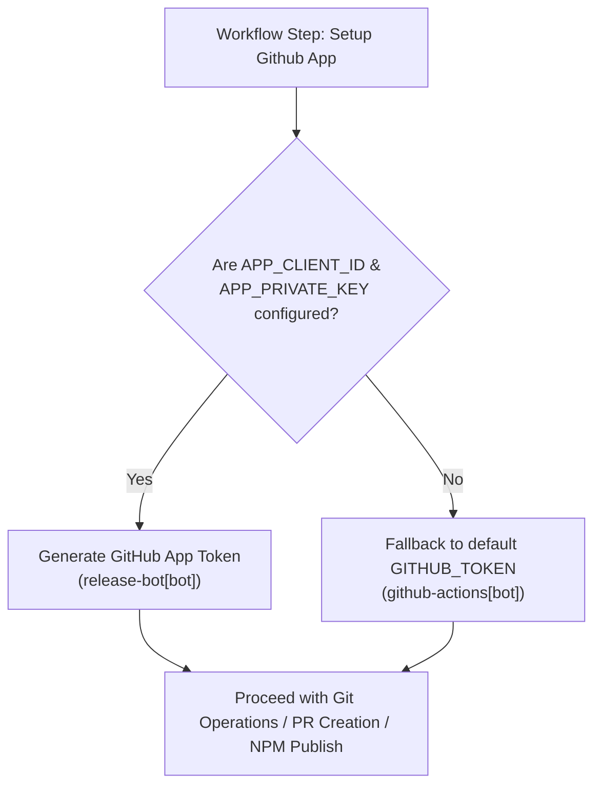
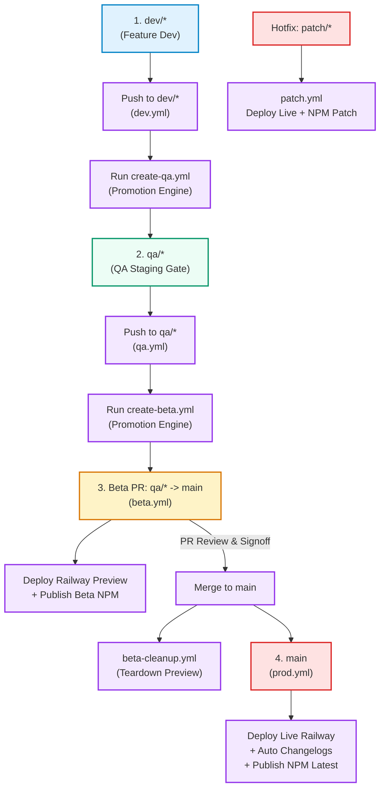

# 🚀 Avivox Workspace — Complete CI/CD & Workflow Guide

Welcome to the **Avivox Workspace Workflow Guide**. This document is a comprehensive, step-by-step manual designed for developers, QA engineers, and DevOps team members to understand, execute, and troubleshoot our automated CI/CD pipeline and release lifecycle.

---

## 📑 Table of Contents

1. [Pipeline Overview & Philosophy](#1-pipeline-overview--philosophy)
2. [Reusable Actions: Local vs External](#2-reusable-actions-local-vs-external)
3. [Authentication: GitHub App vs Fallback Bot](#3-authentication-github-app-vs-fallback-bot)
4. [GitHub Secrets & Environment Configuration](#4-github-secrets--environment-configuration)
5. [Branch Naming Conventions & Validation Rules](#5-branch-naming-conventions--validation-rules)
6. [The 4-Tier Promotion & Deployment Lifecycle](#6-the-4-tier-promotion--deployment-lifecycle)
   - [Tier 1: Feature Development (`dev/*`)](#tier-1-feature-development-dev)
   - [Tier 2: QA Testing & Validation (`qa/*`)](#tier-2-qa-testing--validation-qa)
   - [Tier 3: Beta Staging Preview (`qa/*` ➔ `main` PR)](#tier-3-beta-staging-preview-qa--main-pr)
   - [Tier 4: Production Release (`main`)](#tier-4-production-release-main)
   - [Ephemeral Preview Cleanup](#ephemeral-preview-cleanup)
   - [Emergency Hotfix Pathway (`patch/*`)](#emergency-hotfix-pathway-patch)
7. [Conventional Commits, Version Bumping & Changelogs](#7-conventional-commits-version-bumping--changelogs)
8. [Step-by-Step Playbooks for Team Roles](#8-step-by-step-playbooks-for-team-roles)
   - [Playbook A: Developer — Adding a Feature](#playbook-a-developer--adding-a-feature)
   - [Playbook B: QA Engineer — Testing & Promoting Releases](#playbook-b-qa-engineer--testing--promoting-releases)
   - [Playbook C: Tech Lead — Production Sign-Off & Hotfixes](#playbook-c-tech-lead--production-sign-off--hotfixes)
   - [Playbook D: Scaffolding a New Project From Template](#playbook-d-scaffolding-a-new-project-from-template)
   - [Playbook E: Syncing Downstream Projects from Upstream Template](#playbook-e-syncing-downstream-projects-from-upstream-template)
9. [Troubleshooting & Frequently Asked Questions](#9-troubleshooting--frequently-asked-questions)

---

## 1. Pipeline Overview & Philosophy

The Avivox Workspace CI/CD pipeline guarantees software quality, reproducibility, and zero-downtime releases by strictly enforcing:

- **Isolated Stages**: Code flows systematically across isolated quality gates: `dev/*` ➔ `qa/*` ➔ `beta` (PR to `main`) ➔ `production` (`main`).
- **Automated Validation**: Every commit is verified for TypeScript types, ESLint rules, unit tests (Jest), and build integrity via Turborepo.
- **Ephemeral Staging Environments**: Pull requests targeting `main` automatically provision isolated Railway preview environments with live URLs posted directly into PR comments.
- **Deterministic Semantic Versioning**: Package versions and changelogs are generated automatically via `git-cliff` based on strict Conventional Commits.

```
┌──────────────┐     ┌──────────────┐     ┌──────────────┐     ┌──────────────┐
│  dev/*       │ ──> │  qa/*        │ ──> │  Beta PR     │ ──> │  main (Prod) │
│  (Unit Work) │     │  (QA Gate)   │     │  (Staging)   │     │  (Live App)  │
└──────────────┘     └──────────────┘     └──────────────┘     └──────────────┘
```

---

## 2. Reusable Actions: Local vs External

To ensure maintainability and transparency, our workflows separate repository-specific setup actions from specialized external GitHub actions.

### 🏠 A. Local Composite Actions (Repository Root)

These actions are located in [`.github/actions/`](../.github/actions/) and handle workspace bootstrapping and lint/test execution:

#### 1. Setup Action (`.github/actions/setup`)
- Configures `pnpm` using `pnpm/action-setup@v6`.
- Sets up Node.js 24 with pnpm caching via `actions/setup-node@v6`.
- Executes `pnpm install --frozen-lockfile` to ensure exact dependency matching.
- Compiles shared packages (`pnpm build:packages`) so applications have access to built types and bundles.
- Caches Turborepo outputs (`node_modules/.cache/turbo`, `apps/**/.turbo`, `packages/**/.turbo`, `.turbo`) via `actions/cache@v5`.

#### 2. CI Action (`.github/actions/ci`)
- Executes automated quality checks across the entire monorepo using Turborepo filters:
  - `pnpm lint` — ESLint flat config validation.
  - `pnpm type-check` — TypeScript compiler checks (`tsc --noEmit`).
  - `pnpm test` — Jest unit & component tests.
  - `pnpm build` — Full production builds.
- Accepts configurable inputs (`run-lint`, `run-type-check`, `run-test`, `run-build`) defaulting to `true`.

---

### 🌐 B. External GitHub Actions (`abhisin98/avivox-action-*`)

These actions are published GitHub Actions maintained in dedicated repositories:

#### 1. `abhisin98/avivox-action-setup-github-app@v1`
- **Purpose**: Generates an authenticated GitHub App token from `APP_CLIENT_ID` and `APP_PRIVATE_KEY`.
- **Why It's Used**: Standard `GITHUB_TOKEN` generated by GitHub Actions cannot trigger other workflows or bypass branch protection rules. Using a GitHub App token enables automated branch creation, PR triggers, and bot git attribution (`release-bot[bot]`).
- **Outputs**: `app-token`, `app-slug`.

#### 2. `abhisin98/avivox-action-railway-deploy@v1`
- **Purpose**: Deploys web applications to Railway hosting.
- **Capabilities**:
  - **Preview Deployments** (`preview: true`): Provisions an isolated environment (`preview-<pr-number>`), deploys `apps/web`, and creates/updates a pinned PR comment with the deployment URL.
  - **Environment Teardown** (`cleanup-preview: true`): Deletes ephemeral PR preview environments when pull requests are closed or merged.
  - **Production Deployments** (`preview: false`): Deploys directly to the live Railway environment and returns the deployment URL.

#### 3. `abhisin98/avivox-action-changelogs-and-package-releases@v1`
- **Purpose**: Manages monorepo package versioning, changelogs, and npm distribution.
- **Capabilities**:
  - Automatically calculates semver bumps (major, minor, patch) using `git-cliff` and [`cliff.toml`](../cliff.toml).
  - Updates `package.json` versions and generates individual `CHANGELOG.md` files.
  - In Beta mode (`release-type: beta`): Publishes pre-release packages to npm under the `beta` distribution tag without creating git tags or GitHub releases.
  - In Production mode (`release-type: auto`): Creates git commit `chore(release): ... [skip ci]`, creates git tags (`package@x.y.z`), publishes GitHub Releases, and publishes npm packages with the `latest` tag.
  - In Patch mode (`release-type: patch`): Publishes emergency patch packages to npm with the `latest` tag.

#### 4. `abhisin98/avivox-action-promotion-engine@v1`
- **Purpose**: Automates branch validation, creation, and PR promotion between stages.
- **Capabilities**:
  - Enforces strict regex validation on source branch names.
  - **Target `qa`**: Promotes `dev/feature` ➔ creates `qa/feature` (or opens a PR `dev/*` ➔ `qa/*` if the QA branch already exists and contains diffs).
  - **Target `beta`**: Promotes `qa/feature` ➔ opens PR to `main` with the `beta-release` label and formatted PR template. Skips creation if branches already share the same HEAD.

#### 5. `taiki-e/install-action@git-cliff`
- **Purpose**: Installs pre-compiled `git-cliff` native binaries on Linux runners for high-speed changelog generation.

---

## 3. Authentication: GitHub App vs Fallback Bot

Our workflows support dual authentication mechanisms to accommodate both production teams and local development forks:



### Why GitHub App Authentication is Preferred
1. **Downstream Workflow Triggers**: When `github-actions[bot]` pushes a commit or creates a branch, GitHub intentionally disables triggering subsequent workflow runs to prevent infinite loops. GitHub App tokens act as independent authenticated identities and trigger all required CI checks.
2. **Branch Protection Bypass**: GitHub Apps can be explicitly granted bypass permissions in GitHub Rulesets without exposing admin bypass tokens.
3. **Clean Audit Log**: Git commits and release tags show proper bot attribution (`release-bot[bot] <12345+release-bot[bot]@users.noreply.github.com>`).

---

## 4. GitHub Secrets & Environment Configuration

Configure the following secrets under **Repository Settings → Secrets and variables → Actions**:

### 🔴 Mandatory Deployment Secrets

| Secret Name | Description | Example / Location |
|---|---|---|
| `RAILWAY_API_TOKEN` | Personal API token for Railway API access. | Railway **Account Settings → Tokens → Create Token** (Account-scoped). |
| `RAILWAY_PROJECT_ID` | Railway project identifier. | Found in Railway Project Settings or project URL. |
| `RAILWAY_ENVIRONMENT_ID` | Base Railway environment ID to duplicate for preview environments. | Found in Railway Environment Settings. |
| `RAILWAY_SERVICE_ID` | Web application service identifier within the Railway project. | Found in Railway Service Settings. |
| `NPM_TOKEN` | Automation token for publishing npm packages. | npmjs.com **Access Tokens → Generate New Token (Automation)**. |

### 🤖 Optional GitHub App Secrets (Recommended for Production)

| Secret Name | Description | Example / Location |
|---|---|---|
| `APP_CLIENT_ID` | GitHub App Client ID (e.g. `Iv1...`). | GitHub App General Settings. |
| `APP_PRIVATE_KEY` | GitHub App Private Key (`.pem` format). | GitHub App General Settings ➔ Generate a private key. |

---

## 5. Branch Naming Conventions & Validation Rules

To prevent broken promotion triggers, follow these naming standards:

| Branch Type | Valid Example | Invalid Example | Enforcement Rule |
|---|---|---|---|
| **Development** | `dev/auth-flow`, `dev/user-profile` | `feat/auth`, `dev-login` | Must begin with `dev/` followed by lowercase alphanumeric, hyphens, or underscores. |
| **QA** | `qa/auth-flow`, `qa/user-profile` | `test/auth`, `qa_login` | Created automatically by promotion engine or manually prefixed with `qa/`. |
| **Production** | `main` | `master`, `prod` | Single protected default branch. |
| **Hotfix** | `patch/fix-null-pointer` | `hotfix/bug`, `fix/login` | Must begin with `patch/`. Directly triggers patch deployment. |

---

## 6. The 4-Tier Promotion & Deployment Lifecycle



---

## 7. Conventional Commits, Version Bumping & Changelogs

Avivox Workspace enforces strict Conventional Commits using [commitlint](../commitlint.config.js) and automates changelogs via [git-cliff](../cliff.toml). For complete guidelines, refer to [**Commit Message Guidelines**](COMMIT-GUIDELINES.md) and the [**Copilot Prompt File**](../.github/prompts/commit-message.prompt.md).

```
<type>(<scope>): <subject>
```

#### Allowed Types
`feat` (Minor), `fix` (Patch), `perf` (Patch), `refactor`, `docs`, `build`, `ci`, `chore`, `revert`, `style`, `test`.

#### Allowed Scopes
`cli`, `core`, `docs`, `release`, `ci`, `monorepo`, `deps`, `shared`, `api`, `web`, `eslint-config`, `typescript-config`, `ui`.

---

## 8. Step-by-Step Playbooks for Team Roles

### Playbook A: Developer — Adding a Feature

```bash
# 1. Start from latest main
git checkout main
git pull origin main

# 2. Create feature branch
git checkout -b dev/user-notifications

# 3. Develop, test locally, and format
pnpm test
pnpm lint
pnpm format

# 4. Auto-sync documentation (optional, using Copilot prompt /sync-docs)
# Trigger @workspace /sync-docs to keep all READMEs and architecture matrices in sync.

# 5. Commit using strict conventional commit syntax (or Copilot prompt /commit-message)
git add .
git commit -m "feat(web): add notification bell dropdown component"

# 6. Push branch to GitHub
git push origin dev/user-notifications
```

7. **Promote to QA**:
   - Go to GitHub **Actions** tab.
   - Select **Create QA Branch** workflow.
   - Click **Run workflow** and enter `dev/user-notifications`.
8. **Address QA Feedback**:
   - If QA reports bugs, make commits on your local `dev/user-notifications` branch and push.
   - The open PR (`dev/*` ➔ `qa/*`) updates automatically and reruns CI checks.

---

### Playbook B: QA Engineer — Testing & Promoting Releases

1. **Review & Test Developer PR**:
   - Check out the PR branch `dev/feature` ➔ `qa/feature`.
   - Verify automated CI checks passed.
   - Perform manual exploratory and functional testing.
2. **Merge to QA**:
   - When tests pass, approve and merge the PR into `qa/feature`.
3. **Promote to Beta (Staging)**:
   - Go to **Actions → Create Beta Release PR → Run workflow**.
   - Input: `qa/user-notifications`.
   - The promotion engine creates PR `qa/user-notifications` ➔ `main` with label `beta-release`.
4. **Verify Staging Preview**:
   - Open the PR and locate the automated bot comment with the Railway preview URL (`preview-<pr-number>`).
   - Click the live URL and conduct staging integration tests.

---

### Playbook C: Tech Lead — Production Sign-Off & Hotfixes

1. **Production PR Sign-Off**:
   - Verify code review approvals and passing status checks (`CI`, `Deploy Web (Beta)`, `Publish Packages (Beta)`).
   - Ensure the Railway staging preview test was signed off by QA.
   - Click **Merge pull request** (Rebase or Squash).
2. **Monitor Production Deployment**:
   - Monitor [`.github/workflows/prod.yml`](../.github/workflows/prod.yml) execution in the Actions tab.
   - Confirm web deployment on Railway and verify the new release tag and changelog generated on GitHub.
3. **Emergency Hotfix**:
   - In case of a production emergency, create `patch/hotfix-name` directly from `main`.
   - Push to `patch/*` to trigger immediate production deployment via [`.github/workflows/patch.yml`](../.github/workflows/patch.yml).

---

### Playbook D: Scaffolding a New Project From Template

When using this repository as a template for a new project or repository:
1. Clone the template repository or click **Use this template** on GitHub:
   ```bash
   git clone <your-new-repo-url>
   cd <your-new-repo>
   ```
2. Run the Copilot initialization prompt:
   - Open GitHub Copilot Chat and type:
     ```
     /template-init
     ```
   - Provide your new project name (e.g. `nova-app`), scope (`@nova`), repository URL, and branding.
3. Copilot will automatically rename all package scopes, update code imports, configure tooling configs (`cliff.toml`, `commitlint.config.js`), update documentation, and verify the build.

---

### Playbook E: Syncing Downstream Projects from Upstream Template

When updates (bug fixes, tooling upgrades, CI workflows, or component improvements) are made in the upstream template:
1. In your downstream repository, configure the upstream remote:
   ```bash
   git remote add upstream https://github.com/abhisin98/avivox-workspace.git
   git fetch upstream
   ```
2. Run the Copilot upstream synchronization prompt:
   - Open GitHub Copilot Chat and type:
     ```
     /sync-upstream
     ```
3. Copilot will perform an intelligent merge:
   - **Excludes `apps/` and `packages/`**: Downstream product code, routes, and UI components are strictly protected and skipped.
   - **Syncs CI/CD & Tooling**: Merges upstream workflow improvements, composite actions, prompt updates, docs, and Turbo build configurations.
   - **Respects intentional deletions**: Files or lines deleted intentionally in the downstream project are not blindly restored.
   - **Translates scopes & identity**: Translates `@avivox-workspace/*` to your project's active `@<scope>/*` and preserves project names and URLs.
   - **Runs verification**: Runs `pnpm lint`, `pnpm type-check`, `pnpm test`, and `pnpm build`.

---

## 9. Troubleshooting & Frequently Asked Questions

### ❌ CI Check Fails on Push
- Run `pnpm lint` locally to check for ESLint violations.
- Run `pnpm type-check` to verify TypeScript typings.
- Run `pnpm test` to identify broken unit tests.
- Ensure all commit messages strictly match Conventional Commit specifications (`pnpm --silent commitlint --from=HEAD~1`).

### ❌ Promotion Engine Workflow Fails
- Verify that the input branch matches regex requirements: `dev/*` for QA promotion, or `qa/*` for Beta promotion.
- Ensure branch name contains no uppercase letters, spaces, or illegal punctuation.

### ❌ Railway Deployment Fails
- Verify Railway credentials (`RAILWAY_API_TOKEN`, `RAILWAY_PROJECT_ID`, `RAILWAY_ENVIRONMENT_ID`, `RAILWAY_SERVICE_ID`) are configured in GitHub Secrets.
- Ensure the Railway API token is an Account-level token (not project-scoped).

### ❌ npm Publishing Fails
- Check that `NPM_TOKEN` is valid and has write access to the `@avivox` and `@avivox-workspace` package scopes.
- Ensure that package version bump did not conflict with an already published npm version.

### ❌ PR Cannot Be Merged to `main`
- Check required approvals (1 approval required).
- Verify required status checks: `CI`, `Deploy Web (Beta)`, and `Publish Packages (Beta)`.
- Click **Update branch** if `main` has progressed ahead of the PR branch.

